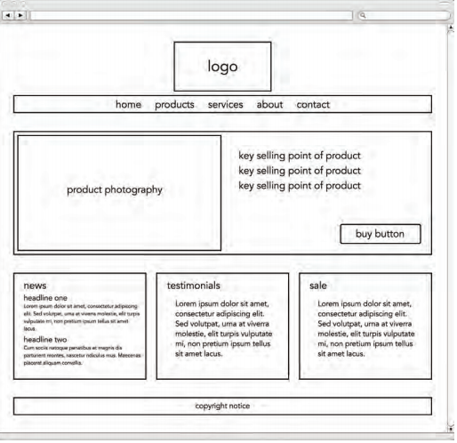

13 march 
# Introduction:
## How People Access the Web :
1. **Browsers**
> People access websites using software called a web browser.
> Popular examples include Firefox, Internet Explorer, Safari, Chrome, and Opera.

2. **Web Servers**
> Web servers are special computers that are constantly connected to the Internet, and are optimized to send web pages out to people who request them.

3. **Devices**
> People are accessing websites on an increasing range of devices including desktop computers, laptops, tablets, and mobile phones.

4. **Screen readers**
> Screen readers are programs that read out the contents of a computer screen to a user. They are commonly used by people with visual impairments.

----------------------------------
## How Websites Are Created :

> All websites use HTML and CSS, but content management systems, blogging software, and e-commerce platforms often add a few more technologies into the mix.
 
## How the Web Works :

> When you visit a website, the web server hosting that site could be anywhere in the world.
> In order for you to find the location of the web server, your browser will first connect to a Domain Name System **(DNS)** server


---------------------------------
------------------------------------------
# Structure
*HTML Uses Elements to Describe the Structure of Pages*

*There are several different elements. Each 
element has an opening tag and a closing tag.*


## Attributes 
*Tell Us More About Elements*
> Attributes provide additional information 
about the contents of an element. They appear 
on the opening tag of the element and are 
made up of two parts: a name and a value, 
separated by an equals sign.


## Body, Head & Title


---------------------
----------------------

# Extra Markup
### 1. DOCTYPEs
> tell browsers which version of HTML you are using.
```
<! DOCTYPE html>
```
### 2. Comments 
```
<!--This is a comment -->
```
### 3. ID Attribute
> - Every HTML element can carry  the id attribute. It is used to  uniquely identify that element  from other elements on the page .
> - id attributes can be 
used to allow the script to work 
with that particular element.
```
<p id="pullquote">Every time I view the sea I feel 
 a calming sense of security, as if visiting my 
 ancestral home; I embark on a voyage of seeing.
</p>
```

### 4. Class Attribute
> Every HTML element can 
also carry a class attribute
```
<p class="important">For a one-year period from 
 November 2010, the Marugame Genichiro-Inokuma 
 Museum of Contemporary Art (MIMOCA) will host a 
 cycle of four Hiroshi Sugimoto exhibitions.</p>
 ```
### 5. Block Elements
> + Some elements will always 
appear to start on a new line in 
the browser window. These are 
known as block level elements. 
> + Examples of block elements are : 
```
<h1>, <p>, <ul>, and <li>.
```

### 6. Inline Elemnts 
> Some elements will always 
appear to continue on the 
same line as their neighbouring 
elements. These are known as 
inline elements.
Examples of inline elements are :
```
<a>, <b>, <em>, and .
```
### 7. Grouping Text & Elements In a Block
> The < div > element allows you to  group a set of elements together in one block-level box.


### 8. Grouping Text & Elements Inline
 
### 9. Iframes
> An iframe is like a little window 
that has been cut into your 
page — and in that window you 
can see another page. The term 
iframe is an abbreviation of inline 
frame.
```
<iframe 
width="450" 
height="350" 
src="http://maps.google.co.uk/maps?q=moma+new+york&amp;output=embed">
</iframe>
```

### 10. meta 
> + The < meta > tag allows you to supply all kinds of 
information about your web page.
> + The < meta > element lives 
inside the < head > element and 
contains information about that 
web page.

-----------------------
----------------------
# html5 layout
### HTML5 introduces a new set of elements that allow you to divide up the parts of a page.


### Headers & Footers :
> The < header > and < footer >
elements can be used for:
> + The main header or footer 
that appears at the top or 
bottom of every page on the 
site.
> + A header or footer for an 
individual < article > or 
< section > within the page

### navigation : 
> The < nav > element is used to 
contain the major navigational 
blocks on the site such as the 
primary site navigation

```
<nav>
<ul>
 <li><a href="" class="current">home</a></li>
 <li><a href="">classes</a></li>
 <li><a href="">catering</a></li>
 <li><a href="">about</a></li>
 <li><a href="">contact</a></li>
</ul>
</nav>
```
### Figures :
> < figure > < figcaption >
> + used to contain any content that is referenced from the main flow of an article (not just images).
> + The < figure > element should 
also contain a < figcaption >
element which provides a text 
decription for the content of 
the < figure > element
```
<figure>

<figcaption>Bok Choi</figcaption>
</figure>
```

----------------------
---------------------
# Process & Design 
### 1. Site Maps
> the aim is to create a diagram 
of the pages that will be used 
to structure the site. This is 
known as a site map and it will 
show how those pages can be 
grouped.


### 2. WireFrames
> A wireframe is a simple sketch of the key 
information that needs to go on each page of a 
site. It shows the hierarchy of the information 
and how much space it might require.



+  Design is about communication. Visual hierarchy helps 
visitors understand what you are trying to tell them.
+ You can differentiate between pieces of information 
using size, color, and style. 
+ You can use grouping and similarity to help simplify 
the information you present.

--------------------------------
----------------------------

# JavaScript 
## JavaScript is the programming language of the Web.JavaScript is one of the 3 languages all web developers must learn:

   1.HTML to define the content of web pages

   2.CSS to specify the layout of web pages

  3.JavaScript to program the behavior of web pages 
   
## Why Study JavaScript?
 ### JavaScript can be used in  browsers to make websites more interactive, interesting, and user-friendly. You can use JavaScript to select any element, attribute, or text from an HTML page. For example: • Select the text inside all of the < hl> elements on a page . Select any elements that have a c 1  ass attribute with a value of note . Find out what was entered into a text input whose id attribute has a value of ema i 1 .
 ## EXAMPLES OF JAVASCRIPT IN THE BROWSER :
 ### Being able to change the content of an HTML page w hile it is loaded in the browser is very powerful. 
 ### The examples below rely on the ability to: 
 #### Access the content of the page 
 #### Modify t he content of the page
 #### Program rules or instructions t he browser can follow
 #### React to events triggered by t he user or browser 
 ## What a Script?
 ### A script is  a series of instructions that a computer can follow to achieve a goal.
 ## Writing a script
 ### To write a script, you need to first state your goal and then list the tasks that need to be completed in order to achieve it.

 ## SKETCHING OUT THE TASKS IN A FLOWCHART:
 ### Often scripts will need to perform different tasks in different situations. You can use flowcharts to work out how the tasks fit together. The flowcharts show the paths between each step.
 
 
 
 
 


 ## EXPRESSIONS
 ### Expressions that just assing a value to a variable 
 ### in order  for a variable to be useful, it needs to be given a value. As you have seen, t his is done using the assignment operator (the equals sign). var color= 'beige'; The value of co 1 or is now beige.
 ### EXPRESSIONS THAT USE TWO OR MORE VALUES TO RETURN A SINGLE VALUE You can perform operations on any number of individual values (see next page) to determine a single value. For example: var area = 3 * 2; The value of area is now 6. 
 ## A BASIC FUNCTION
 
 ### GETTING MULTIPLE VALUES OUT OF A FUNCTION  
 

### FUNCTION DECLARATION 


