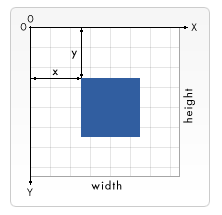

# Basic usage of canvas
The < canvas > element

At first sight a < canvas > looks like the < img > element, with the only clear difference being that it doesn't have the src and alt attributes.

---------------------------------------------

# Drawing shapes with canvas
## The grid

 The origin of this grid is positioned in the top left corner at coordinate (0,0). All elements are placed relative to this origin.

 ## Drawing rectangles
 There are three functions that draw rectangles on the canvas:
 1. fillRect(x, y, width, height)
 Draws a filled rectangle.

 2. strokeRect(x, y, width, height)
 Draws a rectangular outline.
 3. clearRect(x, y, width, height)
Clears the specified rectangular area, making it fully transparent.

## Drawing paths
A path is a list of points, connected by segments of lines that can be of different shapes, curved or not, of different width and of different color. 
To make shapes using paths, we take some extra steps:
1. First, you create the path.
2. Then you use drawing commands to draw into the path.
3. Once the path has been created, you can stroke or fill the path to render it.

Here are the functions used to perform these steps:

[you can check more shapes here ! :\]](https://developer.mozilla.org/en-US/docs/Web/API/Canvas_API/Tutorial/Drawing_shapes)

---------------------------------------------

# Applying styles and colors
*Up until now we have only seen methods of the drawing context. If we want to apply colors to a shape, there are two important properties we can use: fillStyle and strokeStyle.*
fillStyle = color
Sets the style used when filling shapes.
strokeStyle = color
Sets the style for shapes' outlines.

fillStyle = color

Sets the style used when filling shapes.

strokeStyle = color

Sets the style for shapes' outlines.

---------------------------------------------

# Drawing text

[you can see more here :](https://developer.mozilla.org/en-US/docs/Web/API/Canvas_API/Tutorial/Drawing_text)