# Lists
**There are three types of HTML lists:**
  1. Ordered list

  *Ordered lists use numbers.*


  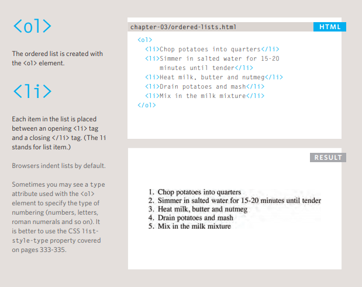

  2. Unordered list

  *Unordered lists use bullets.*


  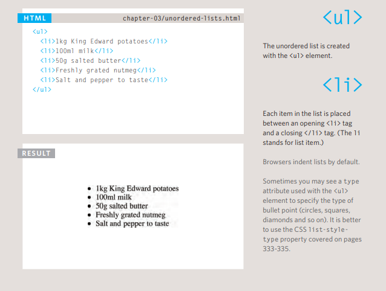

  3. Definition list

  *Definition lists are used to define terminology*


  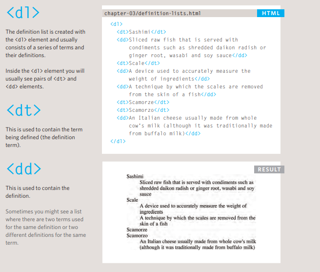

  **(Lists can be nested inside one another.)**
 

# Boxes
   

  1. Box Dimensions :
   **(width, height)**

   > By default a box is sized just big enough to hold its contents. To set your own dimensions for a box you can use the height and width properties.

   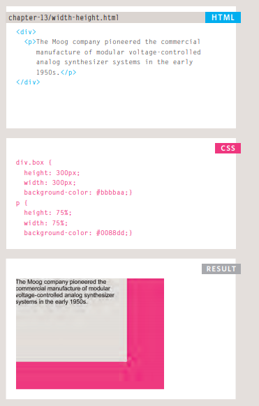

   2. Limiting width:
   **(min-width, max-width)**

   > Some page designs expand and shrink to fit the size of the user's screen. In such designs, the min-width property specifies the smallest size a box can be displayed at when the browser window is narrow, and the max-width property indicates the maximum width a box can stretch to when the browser window is wide.

   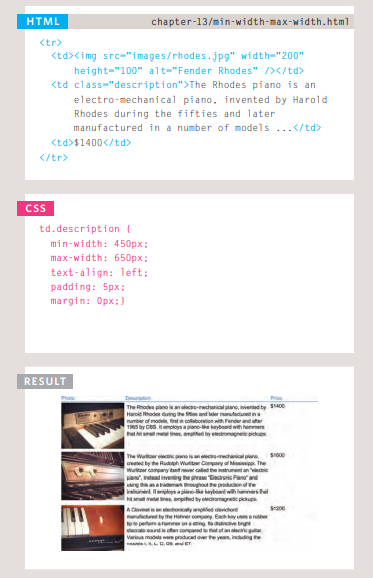

   3. Limiting hight:
   **(min-height, max-height)**

   >In the same way that you might want to limit the width of a box on a page, you may also want to limit the height of it. This is achieved using the min-height and max-height properties.

   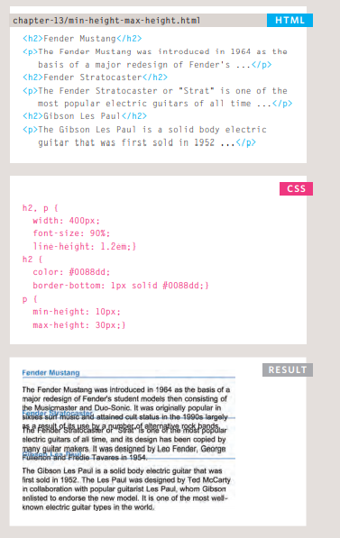

   4. Border, Margin & Padding

   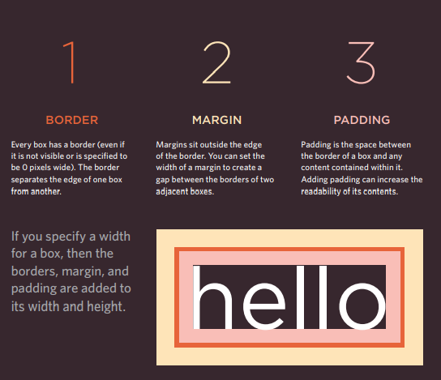

   >Every box has three available properties that can be adjusted to control its appearance:

1. Border
     *(The border separates the edge of one box from another.)*

- border width

       
     >  p.one {
         border-width: 2px;}
       p.two {
         border-width: thick;}
       p.three {
         border-width: 1px 4px 12px 4px;}
       
       

- border style


 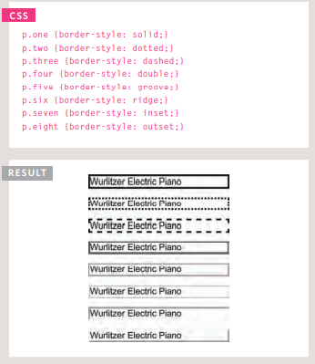
       

- border color
  examples:

  border-color: #0088dd;

  border-color: #bbbbaa #111111 #ee3e80 #0088dd;


2. Margin
     (Margins sit outside the edge of the border.)

3. Padding
     (Padding is the space between the border of a box and any content contained within it. )
     *You can specify different values for each side of a box using:*

     - padding-top
     - padding-right
     - padding-bottom
     - padding-left


----------------------------------------

   ## Border Images 
   > The border-image property applies an image to the border of any box. It takes a background image and slices it into nine pieces. 

   ## Centering Content
   ## Box Shadows
   ## Rounded Corners 
   > border-radius: 10px ;
   ## Elliptical Shapes 
   > To create more complex shapes, you can specify different distances for the horizontal and the vertical parts of the rounded corners.
   > border-top-left-radius: 80px 50px;
   


# Basic JavaScript Instructions
  ## arrays 
  > An array is a special type of variable. It doesn't 
just store one value; it stores a list of values. 


```
 var cars = ["Saab", "Volvo", "BMW"];
```


 [for more info about array please click here ](https://www.w3schools.com/js/js_arrays.asp)
  


# Decisions and Loops

  ## SWITCH STATEMENTS


  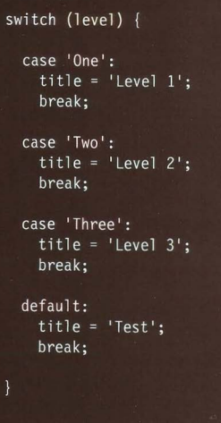

  ## WHILE LOOPS


  >This loop will continue to run 
for as long as the condition in 
the parentheses is true.
  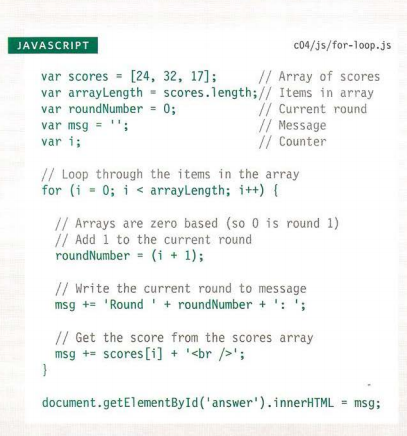

  ## FOR LOOPS 

  >A for loop is often used to loop 
through the items in an array. 
  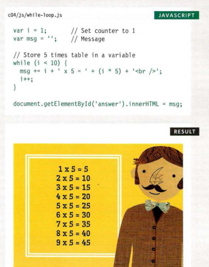

  ## Do WHILE LOOPS

  >The key difference between 
a whi 1 e loop and a do whi 1 e 
loop is that the statements in 
the code block come before the 
condition. This means that those 
statements are run once whether 
or not the condition is met. 

  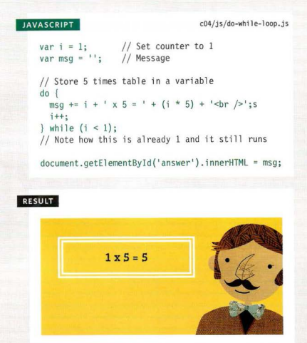