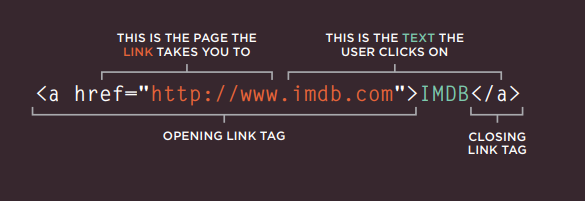
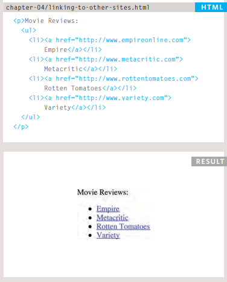
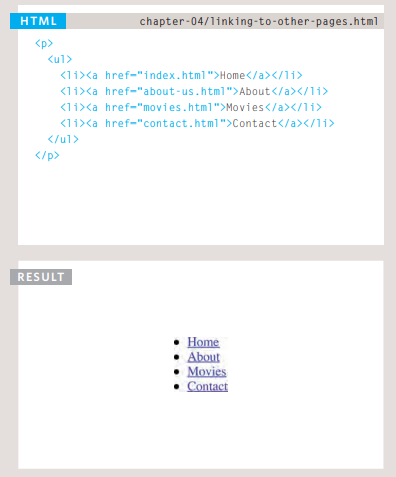
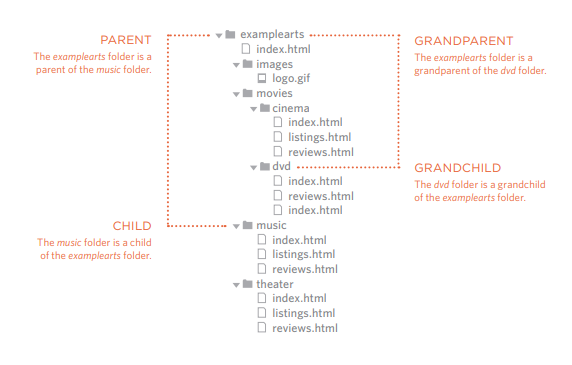

# links
**Links are the defining feature of the web 
because they allow you to move from 
one web page to another.**

1. Writing Links :

   (Links are created using the < a > element. Users can click on anything between the opening < a > tag and the closing < / a > tag. You specify which page you want to link to using the href attribute.)

   


2. Linking to Other Sites :

   (Links are created using the < a > element which has an attribute called href.
    The value of the href attribute is the page that you want people to go to when they click on the link.)

    

3. Linking to Other Pages on the Same Site :

   (When you are linking to other pages within the same site,  you do not need to specify the domain name in the URL.
    You can use a shorthand known as a relative URL)
    

   

4. Directory Structure:
   
   

5. Relative URLs:

   (Relative URLs can be used when linking to pages within your own website. 
   They provide a shorthand way of telling the browser where to find your files.)

|Relative Link Type|Example(from diagram on previous page)         |
|------------------|-----------------------------------------------|
|Same Folder       |< a href="reviews.html">Reviews</ a>           |
|Child Folder      |< a href="music/listings.html">Listings</ a>   |
|Grandchild Folder |< a href="movies/dvd/reviews.html">Reviews</ a>|
|Parent Folder     |< a href="../index.html">Home</ a>             |
|Parent Folder     |< a href="../../index.html">Home</ a>          |

6. Email Links
   
   ```

   <a href="mailto:jon@example.org">Email Jon</a>

   ```

7. Opening Links in a New Window :
   
   (If you want a link to open in a new window, you can use the target attribute on the opening < a > tag. 
   The value of this attribute should be _blank.)

   ```
   <a href="http://www.imdb.com" target="_blank"> Internet Movie Database</a> 

   ```
8. linking to a specific part of the same page or on another page :

   (You can use the id attribute to target elements within a page that can be linked to.) 

   ```
   <h1 id="top">Film-Making Terms</h1>
   <h2 id="interlude">Interlude</h2>
   ```

---------------------------------------


# layout
  ### CSS Website Layout:
  ### Building Blocks:

  

  

 

  ### Containing Elements:
  
   


  ### The position Property:
  >The position property specifies the type of positioning method used for an element.
  >There are five different position values:
   - static
  - relative
  - fixed
  - absolute
  - sticky
  

  ### Screen Sizes
   >Different visitors to your site will have different sized screens that show 
different amounts of information, so your design needs to be able to 
work on a range of different sized screens.

  ### Screen Resolution
  
  ### Page Sizes
  >Because screen sizes and display resolutions vary so much, web 
designers often try to create pages of around 960-1000 pixels wide 


----------------------------------


# Function 
  **WHAT IS A FUNCTION?**

  >Functions let you group a series of statements together to perform a 
  specific task. If different parts of a script repeat the same task, you can 
  reuse the function (rather than repeating the same set of statements).


   ```
   function updateMessage() { 
   var el = document.getElementByld('message'}; 
   el .textContent = msg; 
   } 
   updateMessage(};
   ```
  
   
   
    
   *calling function:*

   
   

   ### There is to kind of function :
   

   --------------------------------
   ## How does pair programming work?
   *pair programming commonly involves two roles:*
   1. the Driver 
   >the programmer who is typing and the only one whose hands are on the keyboard. Handling the “mechanics” of coding, the Driver manages the text editor, switching files, version control, and—of course writing—code. 


   2. and the Navigator. 
   >The Navigator uses their words to guide the Driver but does not provide any direct input to the computer.(should not be writing any code.)

   ### Why pair program?

   **there are four fundamental skills that help anyone learn a new language:**
   
    1. Listening
    2. Speaking
    3. Reading
    4. Writing


   ## 6 Reasons for Pair Programming :
   1. Greater efficiency
   2. Engaged collaboration
   3. Learning from fellow students
   4. Social skills
   5. Job interview readiness
   6. Work environment readiness