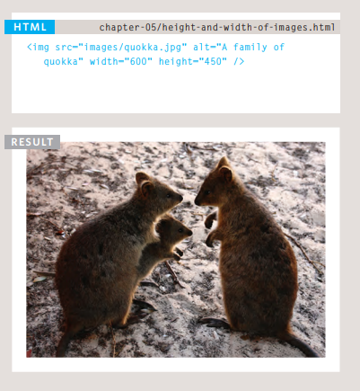
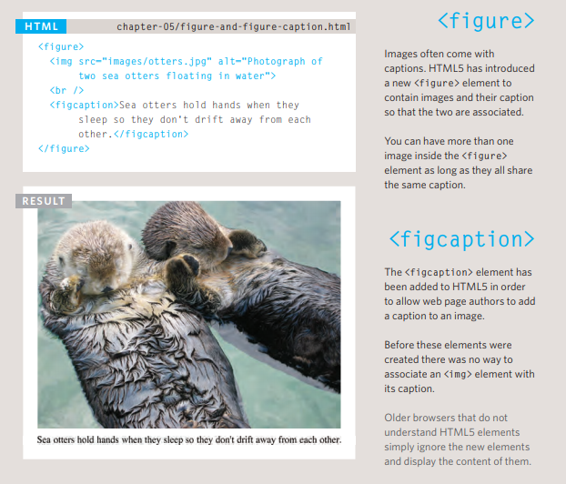

# Images
 If you are building a site from scratch, it is good practice to create a folder for all of the images the site uses.

## Adding Images :
The < img > element is used to add images to a web page.

You must always specify a src attribute to indicate the source of an image and an alt attribute to describe the content of an image.

You should save images at the size you will be using them on the web page and in the appropriate format

## Three Rules for Creating Images:
1. Save images in the right format
2. Save images at the right size
3. Use the correct resolution

## Image Formats :
1. JPEG
2. GIF

## Image Dimensions:
The images you use on your website should be
saved at the same width and height that you
want them to appear on the page.

## Cropping Images
When cropping images it is important not to
lose valuable information. It is best to source
images that are the correct shape if possible

## Image Resolution
Images created for the web should be saved at
a resolution of 72 ppi. The higher the resolution
of the image, the larger the size of the file.

## Vector Images
Vector images differ from bitmap images and
are resolution-independent. Vector images are
commonly created in programs such as Adobe
Illustrator.

## Animated GIFs
Animated GIFs show several frames of an
image in sequence and therefore can be used to
create simple animations.

## Figure and Figure Caption

----------------------------------------

# Color

## The color property allows you to specify the color of text inside an element. You can specify any color in CSS in one of three ways:
1. rgb values
  These express colors in terms of how much red, green and blue are used to make it up. For example: rgb(100,100,90)

2. hex codes
  These are six-digit codes that represent the amount of red, green and blue in a color, preceded by a pound or hash # sign. For example: #ee3e80
3. color names
  There are 147 predefined color names that are recognized by browsers. For example: DarkCyan ,red , blue , ... etc

## background color 
  

## Opacity 

## HSL Colors
  
  
  

------------------------------------------

# Text
## 
## Units of Type Size
  

## Bold 
  The font-weight property
allows you to create bold text.
There are two values that this
property commonly takes:
 
 
## Italic 
If you want to create italic text,
you can use the font-style
property. 

## Drop Shadow
 

## Attribute Selectors

-----------------------------------

# JPEG vs PNG vs GIF

)