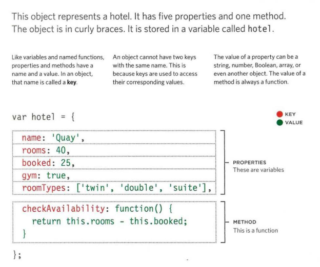
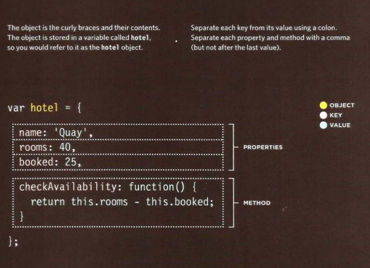
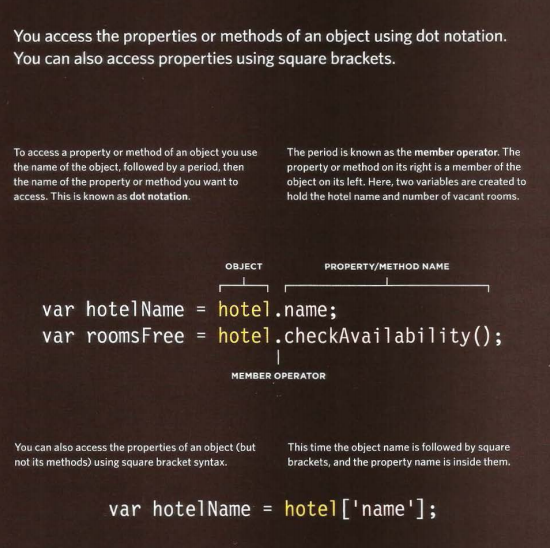
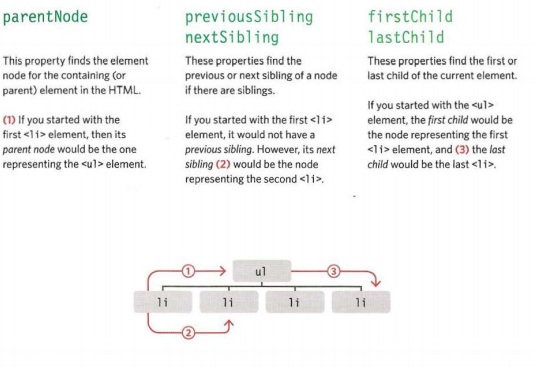
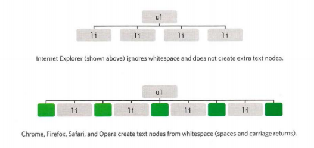
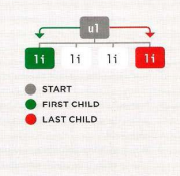
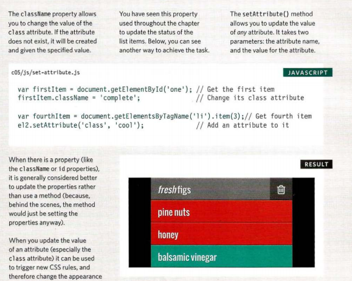
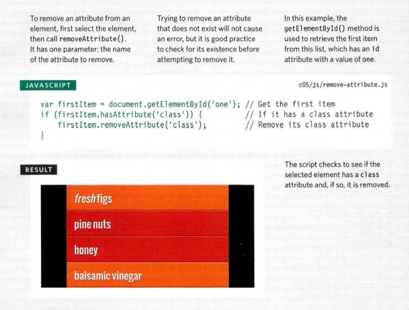

# Object Literals
## what is an object?
Objects group together a set of variables and functions to create a model 
of a something you would recognize from the real world. In an object, 
variables and functions take on new names.

*IN AN OBJECT: VARIABLES BECOME KNOWN AS PROPERTIES*
*IN AN OBJECT: FUNCTIONS BECOME KNOWN AS METHODS*



Above you can see a hotel object. The object 
contains the following key/value pairs: 

|PROPERTIES: |KEY              | VALUE     |  
|------------|-----------------|-----------|
|            |name             | string    |
|            |rooms            | number    |
|            |booked           | number    |
|            |gym              | Boolean   |
|            |room             |Types array|
|METHODS:    |checkAvailability| function  |


## creating an object literal notation 
literal notation is the easiest and most popular way to create objects.


## accessing an object and do not notation 


--------------------------


# Document Object Model

## DOM TREE 


## working with the DOM tree
Accessing and updating the DOM tree involves two steps: 
1. Locate the node that represents the element you want to work with. 
2. Use its text content, child elements, and attributes. 

### STEP 1: ACCESS THE ELEMENTS 
### STEP 2: WORK WITH THOSE ELEMENTS

## SELECTING ELEMENTS USING ID ATTRIBUTES
 getElementByid () allows you 
to select a single element node 
by specifying the value of its 
id attribute. 

## SELECTING ELEMENTS USING CLASS ATTRIBUTES
The getElementsByClassName() 
method allows you to select 
elements whose class attribute 
contains a specific value. 

## SELECTING ELEMENTS USING CSS SELECTORS 
querySelector() returns 
the first element node that 
matches the CSS-style selector. 
querySelectorA11 () returns a 
Nodelist of all of the matches. 

## TRAVERSING THE DOM
When you have an element node, you can select 
another element in relation to it using these five 
properties. This is known as traversing the DOM. 


## WHITESPACE NODES
Traversing the DOM can be difficult because 
some browsers add a text node whenever they 
come across whitespace between elements. 


## FlRST & LAST CHILD


## UPDATE TEXT & MARKUP

   ```
  // Store the first list item in a variable 
var firstitem = document.getElementByid( 'one'); 
// Get the content of the first list item 
var itemContent = firstltem.innerHTML; 

// Update the content of the first list i tem so it is a link 
firstitem.innerHTML = '<a href=\"http:llexample.org\">' + i t emContent + '<la>' ;
   ```

## ADDING ELEMENTS USING DOM MANIPULATION
1. CREATE THE ELEMENT 
createEl ement () 
2. GIVE IT CONTENT
GIVE IT CONTENT
3. ADD IT TO THE DOM
appendChild() 

## ADDING AN ELEMENT TO THE DOM TREE 
  
   ```
  // Create a new element and st ore it in a   variable. 
   var newEl document .createEl ement( ' li '); 
   // Create a text node and store it in a variable. 
   var newText document.createTextNode( 'quinoa ' ); 
   // Attach the new t ext node to t he new element. 
    newEl .appendChild(newText); 
   ```
## CREATING ATTRIBUTES & CHANGING THEIR VALUES

## REMOVING ATTRIBUTES
