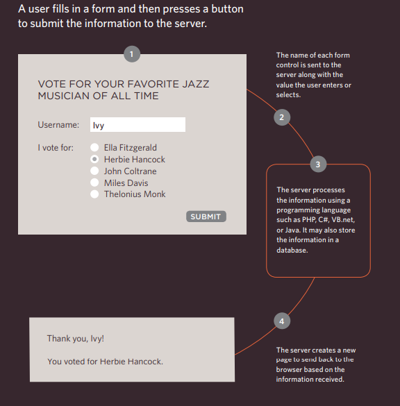

# Forms
## Why Forms?
## Form Controls
There are several types of form controls that 
you can use to collect information from visitors 
to your site.
1. ADDING TEXT
2. Making Choices
3. Submitting Forms:
4. Uploading Files:

## How Forms Work

### Whenever you want to collect information from visitors you will need a form, which lives inside a < form > element.
### Information from a form is sent in name/value pairs.
### Each form control is given a name, and the text the user types in or the values of the options they select are sent to the server.
### HTML5 introduces new form elements which make it easier for visitors to fill in forms.

---------------------------------------

# Lists, Tables & Forms

## In addition to the CSS properties covered in other 
chapters which work with the contents of all elements, 
there are several others that are specifically used to 
control the appearance of lists, tables, and forms.
## List markers can be given different appearances 
using the list-style-type and list-style image 
properties.
## Table cells can have different borders and spacing in 
different browsers, but there are properties you can 
use to control them and make them more consistent. 
## Forms are easier to use if the form controls are 
vertically aligned using CSS.
## Forms benefit from styles that make them feel more 
interactive

