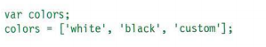
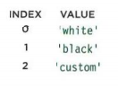
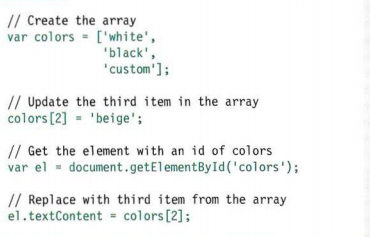

### How JS Makes Web Pages more Interactive ??
- JS allows u to make web pages more interactive by:
     1. Accessing Content
       - you can use JS to select any element,attribute,or text 
     2. Modifying Content
       - you can use JS to add element, attribute,and text 
     3. Program rules or instructions the browser can follow 
     4. React to events triggered by the user or browser 

-----------------------------
### What is a Script ? 
* A SCRIPT IS A SERI ES OF INSTRUCTIONS 
* To write a script, you need to first state your goal and then list the tasks that need to be completed in order to achieve it.
* Start with the big picture of what you want to achieve, and break that down into smaller steps. 
     1. DEFINE THE GOAL 
     2. DESIGN THE SCRIPT 
     3. CODE EACH STEP
---------------------------------- 
### RULES FOR NAMING VARIABLES :
1. The name must begin with a letter, dollar sign ($),or an (_). It must not start with a number. 
2. Note that you must not use a dash(-) or a period (.) in a variable name.
3. You cannot use keywords or reserved words
4. All variables are case sensitive
5. Use a name that describes the kind of information that the variable stores. 
6. If your variable name is made up of more than one word, use a capital letter for the first letter of every word after the first word. 
----------------------------------
### ARRAYS 

#### VALUES IN ARRAYS :

#### ACCESSING & CHANGING VALUES IN AN ARRAY:

**Arrays are special types of variables that store more than one piece of related information.**

