# TEXT
### 1. Headings
```
<h1>This is a Main Heading</h1>
<h2>This is a Level 2 Heading</h2>
<h3>This is a Level 3 Heading</h3>
<h4>This is a Level 4 Heading</h4>
<h5>This is a Level 5 Heading</h5>
<h6>This is a Level 6 Heading</h6>

```

### 2. Paragraphs
```
<p> A paragraph consists of one or more sentences 
 that form a self-contained unit of discourse. The 
 start of a paragraph is indicated by a new 
 line.</p>

 ```
 ### 3. Bold & Italic
 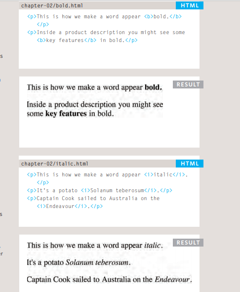

 ### 4. Superscript & Subscript
  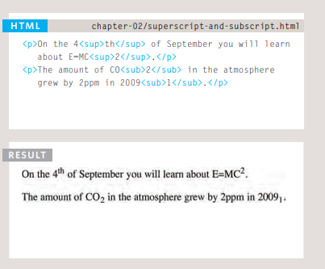

### 5. White Space
> When the browser comes across 
two or more spaces next to each 
other, it only displays one space. 

--------------------
## Semantic Markup

**When the browser comes across  two or more spaces next to each other, it only displays one space.** 

1. Strong & Emphasis
> + The use of the < strong >
element indicates that its 
content has strong importance. 
> + The <em> element indicates 
emphasis that subtly changes 
the meaning of a sentence.

2. Quotations
> There are two elements 
commonly used for marking up 
quotations:
> 1. < blockquote >
> 2. < q >

3. Abbreviations & Acronyms
```
p><abbr title="Professor">Prof</abbr> Stephen 
 Hawking is a theoretical physicist and 
 cosmologist.</p>
<p><acronym title="National Aeronautics and Space 
 Administration">NASA</acronym> do some crazy 
 space stuff.</p>

```
4. Citations & Definitions
```
<p><cite>A Brief History of Time</cite> by Stephen 
 Hawking has sold over ten million copies 
 worldwide.</p>

 <p>A <dfn>black hole</dfn> is a region of space from 
 which nothing, not even light, can escape.</p>

```
5. Author Details
```
address>
<p><a href="mailto:homer@example.org">
 homer@example.org</a></p>
<p>742 Evergreen Terrace, Springfield.</p>
</address>

```
  
6. Changes to Content
> The < ins > element can be used 
to show content that has been 
inserted into a document, while 
the < del > element can show text 
that has been deleted from it


---------------


#  Introducing CSS

###  CSS Properties Affect How Elements Are  Displayed
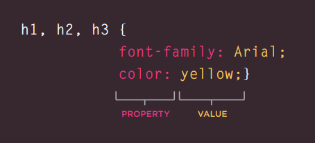

### 1. Using External CSS
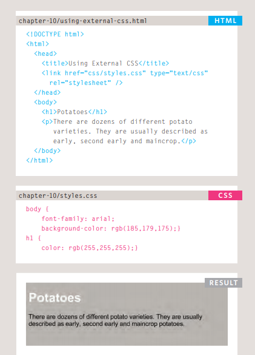


### 2. Using internal CSS
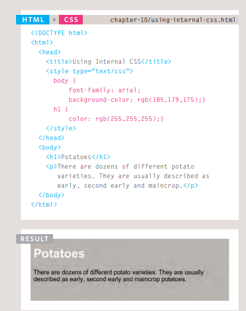

### CSS Selectors
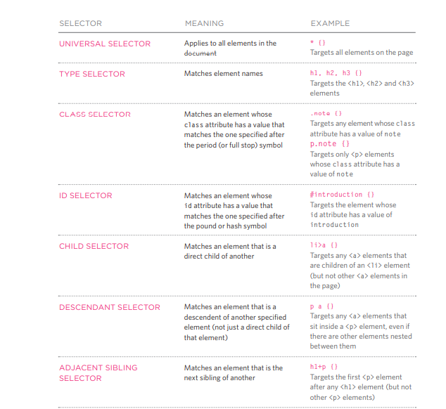

-------------------------------------------


# Basic JavaScript Instructions
 ### 1. STATEMENTS
 > A script is a series of instructions that a computer can follow one-by-one. 
Each individual instruction or step is known as a statement. 
Statements should end with a semicolon. 
 ### 2. COMMENTS
 > You should write comments to explain what your code does. 
They help make your code easier to read and understand. 
This can help you and others who read your code. 
 ### 3. WHAT IS A VARIABLE?
 > a script will have to temporarily 
store the bits of information it 
needs to do its job. It can store this 
data in variables.
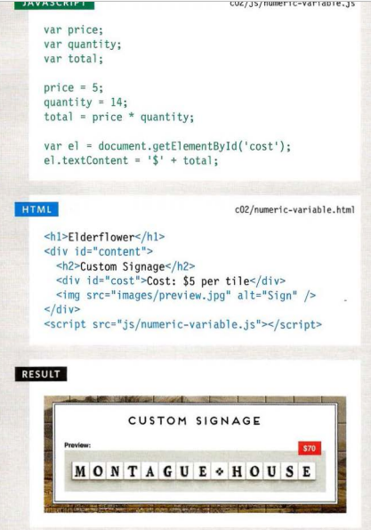
 ### 4. DATA TYPES
 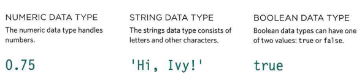
 ### 5. RULES FOR NAMING VARIABLES 
 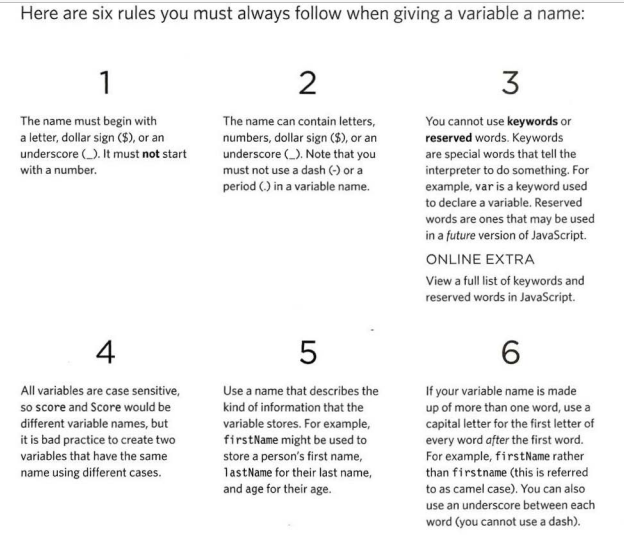
 ### 6. ARRAYS
 > An array is a special type of variable. It doesn't 
just store one value; it stores a list of values.
```
var colors; 
colors ['white', 'black', ' custom']; 
var el document.getElementByld('col ors'); 
el . textContent = col ors[O]; 

```
 ### 7. EXPRESSIONS
 > evaluates into (results in) a single value. Broadly speaking 
there are two types of expressions. 
> 1. EXPRESSIONS THAT JUST ASSIGN A 
VALUE TO A VARIABLE 
```
var color = 'beige'; 
```

> 2. EXPRESSIONS THAT USE TWO OR 
MORE VALUES TO RETURN A 
SINGLE VALUE
```
var area = 3 * 2; 
```

 ### 8. OPERATORS
 #### + ARITHMETIIC OPERATORS
 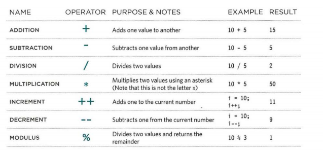
 #### + STRING OPERATORS
 > There is just one string operator: the+ symbol. 
It is used to join the strings on either side of it. 
```
var firstName = 'Ivy ' ; 
var lastName = ' Stone' ; 
var ful l Name = f irstName + l astName ;
```

# Decisions and Loops
### there are 2 components to a decision:
 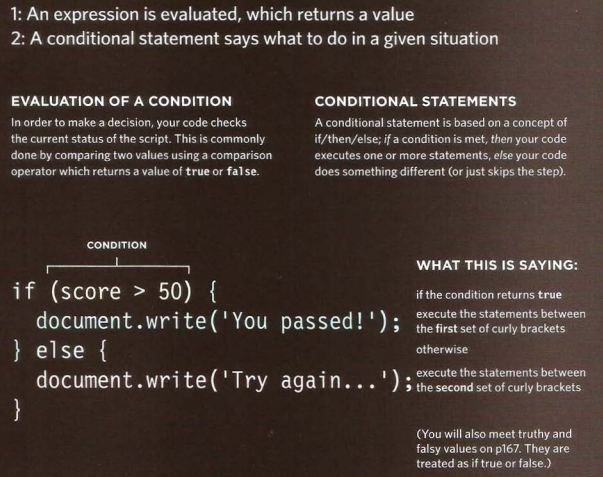

 ### COMPARISON OPERATORS
 ```
 var pass = 50; II Pass mark 
var score = 90; II Score 
II Check if t he user has passed 
var hasPassed = score >= pass; 
II Write the message i nt o the page 
var el = document .getEl ementByld(' answe r '); 
e 1 . t extContent = 'Leve 1 passed: ' + has Passed; 
```
### Logical OPERATORS
 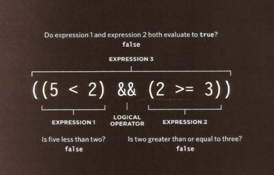
 
### IF ELSE STATEMENTS 
```
var pass = 50; 
var score = 75; 
var msg; 


if (score >= pass) { 
msg = 'Congratulations, you passed!'; 
} else { 
msg = 'Have another go!'; 
var el = document .getElementByld('answer'); 
el .textContent = msg; 
```