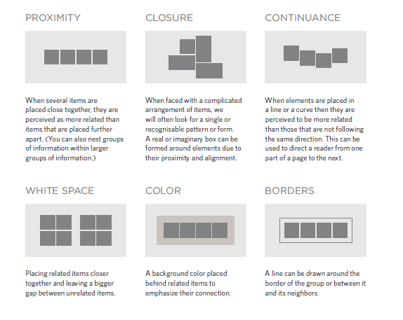

# Process & Design 
 * Every website should be designed for the target audience so you must understand who your target audience is.
 * You must know why people visit your website and what Information Your Visitors Need.
 * after you know what needs to appear on your site, you can start to organize the information into sections or pages. 
 * The aim is to create a diagram of the pages that will be used to structure the site. This is known as a site map and it will show how those pages can be grouped.
 
 * WireFrames: A wireframe is a simple sketch of the key information that needs to go on each page of a site. It shows the hierarchy of the information and how much space it might require.
 
  * grouping and Similarity
  
  * Designing Navigation
   Site navigation not only helps people find where they want to go, but also helps them understand what your site is about and how it is organized.

# html Layout
 * The new HTML5 elements indicate the purpose of different parts of a web page and help to describe its structure.
 * The new elements provide clearer code (compared with using multiple 
 elements).

  **new html5 layout elemnts** 
  1. Headers & Footers 

  2. Navigation

  3. Articles

  4. rticle

 
# Extra Markup
 
 1. DOCTYPE 
   > defines that this document is an HTML5 document.

2. Comment 
   < ! -- comment goes here  -->

3. inline elemnts
    Examples of inline elements are
    < a >, < b >, < em >, and < img >.

4. IFrames
   little window that has been cut into your page — and in that window you can see another page.
    **<iframe> element. There are a few attributes that you will need to know to use it:**
    1. src 
    2. hieght
    3. width

5. Div 
   The < div > element allows you to group a set of elements together in one block-level box.

