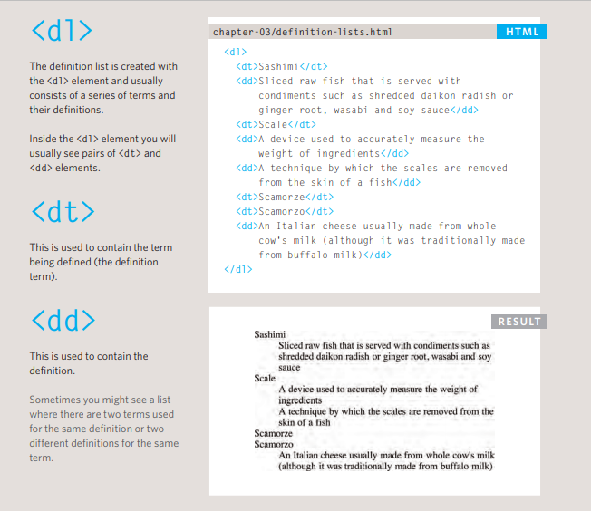
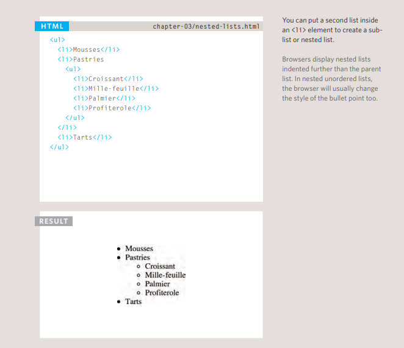
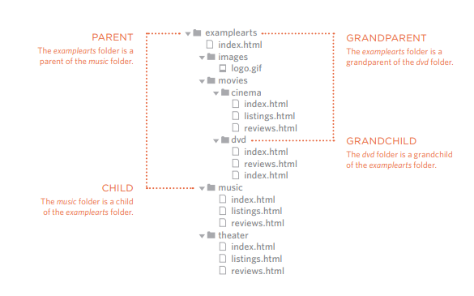
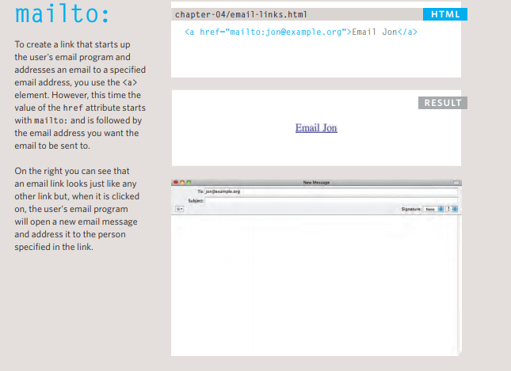
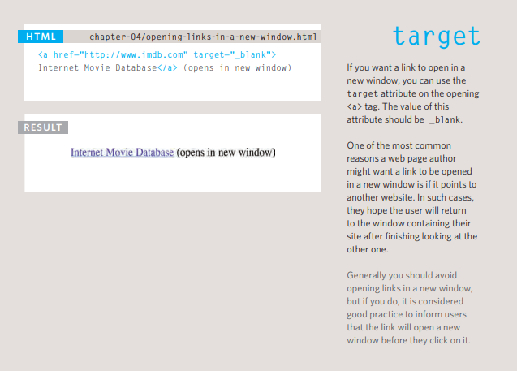

## How People Access the Web:
1. Browsers
2. Web Servers
3. Devices
4. Screen readers
----------------------------------
## How Websites Are Created:
#### How it is Created??
1. Small websites are often written just using HTML and CSS.
2. Larger websites  updated regularly and use a **content management system**(CMS), blogging tools, or e-commerce software — often make use of more complex technologies on the web server
but these technologies are actually used to produce HTML and CSS that is then sent to the browser
3. Larger, more complex sites like these may use a database to store data, and programming languages such as PHP, ASP.Net,Java, or Ruby on the web server,
----------------------------------
## How the Web Works??
1. When you connect to the web, you do so via an Internet Service Provider (ISP). You type a
domain name or web address into your browser to visit a site
2. Your computer contacts a network of servers called Domain Name System (DNS) servers.
they tell your computer the IP address associated with the requested domain name.
3. The unique number that the DNS server returns to your computer allows your browser to contact the web server that hosts the website you requested
4. The web server then sends the page you requested back to your web browser.

----------------------------
----------------------------
----------------------------
## we already talk about ordered and unordered lists , there is also another list :
- Definition Lists

- Nasted Lists

 

> [X] Ordered lists use numbers.
[X] Unordered lists use bullets.
[X] Definition lists are used to define terminology.
[X] Lists can be nested inside one another.
---------------------------
## Directory Structure:

#### Structure
* The top-level folder is known
as the **root** folder. The root folder contains all of the other files and folders for a website.
* Each section of the site is placed in a separate folder; this helps organize the files.
#### Relationships
* The relationship between files and folders on a website is described using the same terminology as a family tree
#### Homepages
The main homepage of a site written in HTML (and the homepages of each section in a child folder) is called **index.html**
> 1. Every page and every image on a website has a URL.
> 2. You use URLs when linking
to other web pages and when
including images in your own
site.
---------------------------
## Relative URLs
* Relative URLs can be used when linking to pages within your own website. They provide a shorthand way of telling the browser where to find your files.
----------------------------
## Email Links

--------------------------------
## Opening Links in a New Window
