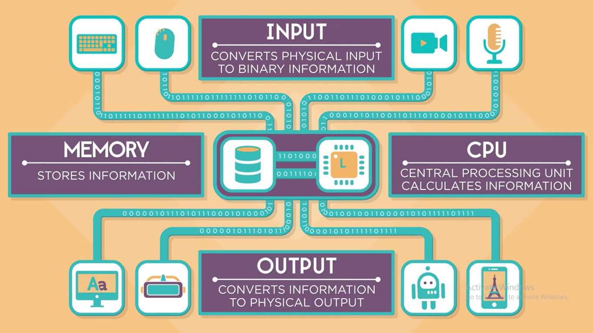

# Computers Are Changing The world 
## How information is represented using electricity ?
> using  tiny electrical signals going **ON** and **OFF** at mind-boggling speeds.
----------------------------
## The four Parts of a computer :
1. **input**
   - mouse
   - keyboard
   - microphone
   - camera 

2. **output**
   > a computer display can show text,photo,video,VR 
3. **Memory(Storage)** 
4. **CPU(Processing)**
   > - Computer's processor takes information from memory and manipulates it using Algorithm
   > - and it send the proccessed info back to stored in memory again 
   > - this continues until the processed info is ready to output.
   ---------------------------
   ### - computers work on ones and zeros
   ### - wires & circuits carry all the info in a computer
   ### - electricty moves at just about the speed of light 
   
